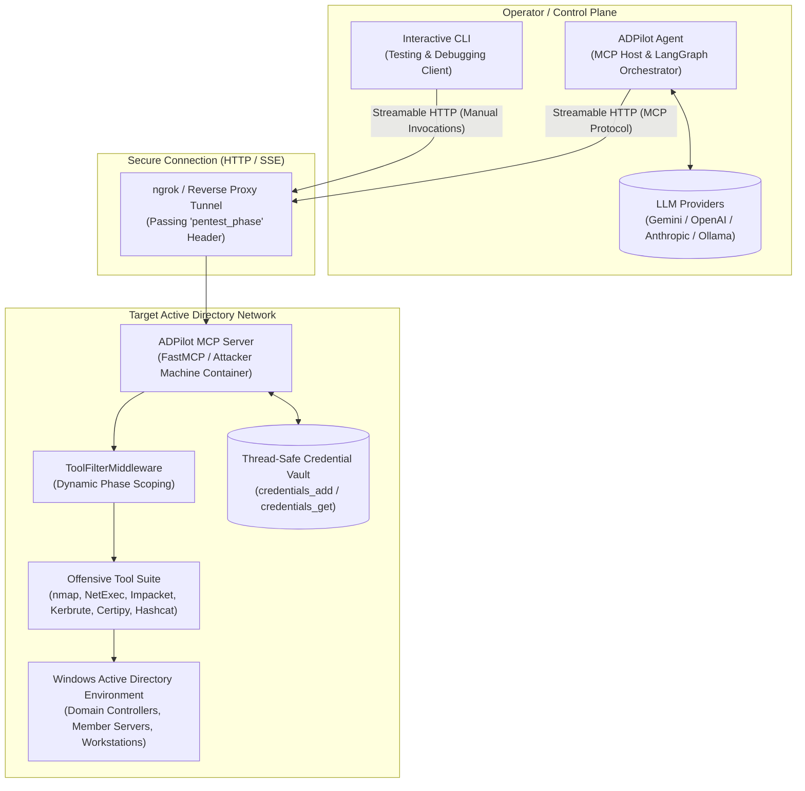
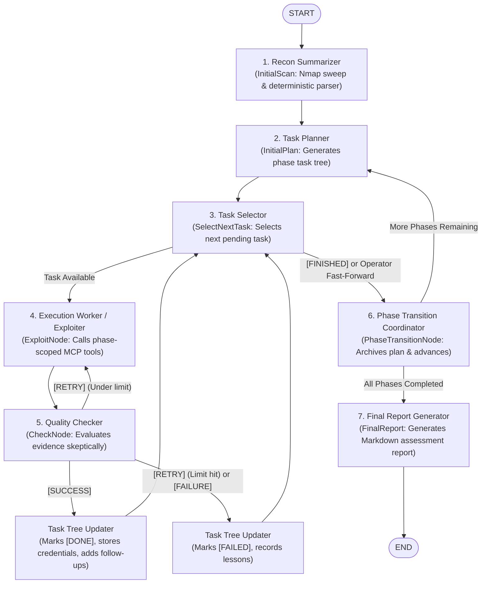

# ADPilot

> **Pentesting Automation Using LLMs for Windows Active Directory Systems**

[](https://www.python.org/downloads/)
[](https://github.com/langchain-ai/langgraph)
[](https://modelcontextprotocol.io/)
[](https://github.com/jlowin/fastmcp)
[](adpilot-mcp-server/compose.yaml)
[](#disclaimer)

---

**ADPilot** is an autonomous, multi-agent penetration testing system that leverages Large Language Models (LLMs) to perform authorized security evaluations of Windows Active Directory (AD) enterprise environments.

By decoupling cognitive orchestration from offensive tool execution via the **Model Context Protocol (MCP)**, ADPilot allows an LLM-driven control plane to safely and systematically plan, execute, verify, and document penetration tests. The system enforces a **strict phased methodology**, exposing only phase-relevant offensive tools to the LLM agents and preventing premature lateral movement or out-of-scope actions.

---

## Table of Contents

- [System Overview](#system-overview)
- [System Architecture](#system-architecture)
- [Subproject Overview](#subproject-overview)
  - [1. adpilot-agent (MCP Host & Orchestrator)](#1-adpilot-agent-mcp-host--orchestrator)
  - [2. adpilot-mcp-server (Offensive Execution Server)](#2-adpilot-mcp-server-offensive-execution-server)
  - [3. cli (Debugging & Testing Tool Runner)](#3-cli-debugging--testing-tool-runner)
- [Pentest Phases & Methodology](#pentest-phases--methodology)
- [Multi-Agent Workflow (LangGraph)](#multi-agent-workflow-langgraph)
- [Quickstart Guide](#quickstart-guide)
  - [Step 1: Deploy the MCP Server (Target Network)](#step-1-deploy-the-mcp-server-target-network)
  - [Step 2: (Optional) Verify via the Debugging CLI](#step-2-optional-verify-via-the-debugging-cli)
  - [Step 3: Run the Autonomous Agent](#step-3-run-the-autonomous-agent)
- [Configuration Reference](#configuration-reference)
- [Safety & Operational Guardrails](#safety--operational-guardrails)
- [Telemetry & Reporting](#telemetry--reporting)
- [Disclaimer](#disclaimer)

---

## System Overview

Traditional penetration testing in complex Active Directory environments requires navigating multi-stage attack paths (e.g., initial reconnaissance, credential harvesting, Kerberos ticket manipulation, privilege escalation, and domain compromise). 

ADPilot automates this process through:
1. **Separation of Concerns (MCP Host & Server)**: The LLM reasoning engine ([`adpilot-agent`](./adpilot-agent)) acts as an **MCP Host** running on an operator/control machine. It connects over HTTP/SSE (direct or through an ngrok tunnel) to the [`adpilot-mcp-server`](./adpilot-mcp-server) deployed inside an attacker container or virtual machine on the target network.
2. **Phase-Bounded Operation**: Assessments are structured into four sequential phases. Offensive tools are filtered dynamically so that agents only see tools aligned with the current operational objective.
3. **Hierarchical Multi-Agent Graph**: Instead of an unconstrained single prompt, ADPilot coordinates specialized agent personas (Recon Summarizer, Planner, Selector, Worker/Exploiter, Quality Checker, Tree Updater, and Final Reporter) using **LangGraph**.
4. **Evidence-Driven Task Tree**: The agent plans and maintains hierarchical task trees that dynamically adapt based on proven technical findings rather than speculative hallucinations.
5. **Human-in-the-Loop & Interactive Controls**: Operators can supervise execution in real time, inspect tool invocations, or fast-forward phases at will.

---

## System Architecture



---

## Subproject Overview

The repository is organized into three distinct subprojects:

```
ADPilot/
├── adpilot-agent/          # Main Application: MCP Host & Multi-Agent Orchestrator
├── adpilot-mcp-server/     # Main Application: Remote Offensive MCP Server
└── cli/                    # Diagnostic Tool: Interactive MCP Client for Testing/Debugging
```

### 1. [adpilot-agent](./adpilot-agent)
*Main Application — MCP Host & Multi-Agent Orchestrator*

- Implemented in Python 3.12+ using **LangGraph**, **LangChain MCP Adapters**, and **Pydantic Settings**.
- Drives the state machine across all pentest phases, coordinating specialized agents to break down high-level objectives into tactical subtasks.
- Implements resilient execution interceptors that enforce tool call budgets, avoid repeated tool loops, handle tool errors gracefully, and capture execution metrics.
- Supports **Remote** (Google Gemini, OpenAI, Anthropic, OpenRouter), **Local** (Ollama), and **Hybrid** execution modes.
- Generates comprehensive technical and executive Markdown reports upon completion.
- See the [adpilot-agent README](./adpilot-agent/README.md) for full details.

### 2. [adpilot-mcp-server](./adpilot-mcp-server)
*Main Application — Remote Offensive MCP Server*

- Built with **FastMCP** and packaged as a Docker container running Ubuntu Linux with a comprehensive penetration testing toolchain.
- Deployed inside or adjacent to the target Active Directory network to run commands locally with native network access.
- Exposes structured MCP tools spanning reconnaissance (`nmap`, `nslookup`), enumeration (`NetExec`, `ldapsearch`, `smbclient`), Kerberos manipulation (`kerbrute`, `GetNPUsers`, `GetUserSPNs`, `getTGT`, `getST`, `hashcat`), and lateral movement/privilege escalation (`secretsdump`, `wmiexec`, `certipy`, `mssqlclient`, `printerbug`).
- Features a **`ToolFilterMiddleware`** that reads the `pentest_phase` HTTP header to expose only tools approved for the active phase.
- Incorporates a thread-safe credential store and process group isolation for robust command execution.
- Includes preconfigured Docker Compose and ngrok configuration for straightforward remote exposure.
- See the [adpilot-mcp-server README](./adpilot-mcp-server/README.md) for full details.

### 3. [cli](./cli)
*Diagnostic Tool — Interactive MCP Client for Testing and Debugging*

- A standalone terminal application built with `rich` and `prompt-toolkit` to interact directly with the MCP server without running the autonomous agent.
- Reuses the `adpilot-agent` MCP connection stack and configuration settings.
- Features:
  - Tool discovery, filtering, and schema inspection (`list`, `search <term>`, `info <tool>`).
  - Interactive, schema-driven parameter prompting with type validation and enum selection.
  - Phase switching (`phase shell_only`, `phase external_reconnaissance`) to test phase filtering.
  - Rich output formatting showing executed command syntax, exit status, and formatted `stdout`/`stderr`.
- Designed for operators to verify network connectivity, authenticate, and test tool invocations before starting automated agent runs.
- See the [cli README](./cli/README.md) for full details.

---

## Pentest Phases & Methodology

ADPilot enforces a phased operational workflow. Tools and agent permissions are restricted to the current phase to ensure logical progression:

| Phase | Identifier | Core Objective | Permitted Activities | Forbidden Activities |
| :--- | :--- | :--- | :--- | :--- |
| **1. External Reconnaissance** | `external_reconnaissance` | Perimeter mapping & surface discovery | Port scanning (`nmap`), DNS lookups (`nslookup`), SMB null sessions, unauthenticated user enumeration (`kerbrute`). | Credential testing, password spraying, authentication attempts, exploitation. |
| **2. Initial Access** | `initial_access` | Establish first authenticated foothold | AS-REP roasting (`GetNPUsers`), Kerberoasting (`GetUserSPNs`), password spraying (`kerbrute`), offline hash cracking (`hashcat`). | Deep internal AD mapping, privilege escalation, lateral movement, persistence. |
| **3. Internal Reconnaissance** | `internal_reconnaissance` | Map domain objects & attack paths | LDAP enumeration (`ldapsearch`, `ldapdomaindump`, `GetADUsers`), delegation discovery (`findDelegation`), RID cycling (`lookupsid`). | Active privilege escalation, lateral movement, account modification. |
| **4. Lateral Movement & PrivEsc** | `lateral_movement_and_privilege_escalation` | Demonstrate privilege escalation & domain compromise | AD CS abuse (`certipy`), remote execution (`wmiexec`), credential extraction (`secretsdump`), ticket forging (`ticketer`). | Out-of-scope destructive actions, unapproved data destruction. |

---

## Multi-Agent Workflow (LangGraph)

ADPilot Agent executes a stateful graph where each node represents a specialized LLM agent or deterministic transition:



### Specialized Agent Roles

1. **Recon Summarizer (`InitialScan`)**: Executes baseline network discovery and parses raw Nmap output into structured host/port metadata without speculative additions.
2. **Task Planner (`InitialPlan`)**: Formulates an initial, structured task tree (e.g., `1.1`, `1.2`) strictly bounded by the rules and tools of the current phase.
3. **Task Selector (`SelectNextTask`)**: Selects the next pending task, aggregates relevant context (domain, IPs, captured credentials, hashes), and feeds it to the worker. Emits `[FINISHED]` when no pending tasks remain.
4. **Execution Worker (`ExploitNode`)**: Executes offensive MCP tools, diagnoses command errors, adjusts parameters, and collects technical evidence.
5. **Execution Quality Checker (`CheckNode`)**: Skeptically reviews tool execution outputs to confirm objective achievement before marking tasks successful. Automatically records validated credentials into the server vault (`credentials_add`).
6. **Task Tree Updater (`UpdatePlanSuccess` / `UpdatePlanFailure`)**: Updates task statuses and introduces follow-up tasks only when concrete evidence warrants them.
7. **Phase Transition Coordinator (`PhaseTransitionNode`)**: Archives completed phase plans into historical memory and transitions to the subsequent phase.
8. **Final Report Generator (`FinalReport`)**: Gathers all phase task trees and captured credentials to produce an executive and technical penetration test report with targeted remediation guidance.

---

## Quickstart Guide

### Step 1: Deploy the MCP Server (Target Network)

Deploy the MCP server on an attacker machine (or container) with direct network visibility into the target Active Directory environment.

1. Navigate to [`adpilot-mcp-server`](./adpilot-mcp-server):
   ```bash
   cd adpilot-mcp-server
   cp .env.example .env
   ```

2. Configure `.env` with your desired port and ngrok credentials:
   ```ini
   HOST=0.0.0.0
   PORT=8000
   AD_STATE_DIR=./ad-pentest/state
   NGROK_AUTHTOKEN="your-ngrok-token"
   NGROK_DOMAIN="your-subdomain.ngrok-free.app"
   ```

3. Start the container suite via Docker Compose:
   ```bash
   docker compose up -d
   docker compose logs -f server
   ```

### Step 2: (Optional) Verify via the Debugging CLI

Before launching autonomous execution, verify server connectivity and tool execution using the diagnostic CLI:

1. Navigate to [`cli`](./cli):
   ```bash
   cd ../cli
   uv sync
   ```

2. Configure environment variables (or rely on `adpilot-agent/.env`):
   ```bash
   # Run the interactive tool client
   uv run mcp-cli
   ```

3. Test basic operations:
   ```text
   mcp> list
   mcp> search nmap
   mcp> 1
   mcp> phase external_reconnaissance
   ```

### Step 3: Run the Autonomous Agent

1. Navigate to [`adpilot-agent`](./adpilot-agent):
   ```bash
   cd ../adpilot-agent
   cp .env.example .env
   ```

2. Configure `.env`:
   ```ini
   # MCP Server Endpoint
   ATTACKER_MACHINE_URL="https://your-subdomain.ngrok-free.app/mcp"
   ATTACKER_MACHINE_AUTH_TOKEN="user:password"

   # Target Active Directory Scope
   NETWORK="192.168.122.0/24"
   DC_IP="192.168.122.10"
   IGNORED_HOSTS="192.168.122.1,192.168.122.2"

   # LLM Model Configuration
   MODEL_MODE="remote"
   REMOTE_MODEL="gemini-2.5-flash"
   REMOTE_API_KEY="your-api-key"
   ```

3. Install dependencies and start the agent:
   ```bash
   uv sync
   uv run adpilot-agent
   ```

4. **Interactive Monitoring**:
   - Watch real-time execution steps and agent decisions in the console.
   - At any time during execution, type `n` or `next` and press <kbd>Enter</kbd> to fast-forward past the current phase.

---

## Configuration Reference

Key settings configurable via environment variables or `.env` files:

| Variable | Component | Default | Description |
| :--- | :--- | :--- | :--- |
| `ATTACKER_MACHINE_URL` | Agent / CLI | *Required* | Streamable HTTP endpoint for the MCP Server (e.g. `http://host:8000/mcp` or ngrok URL). |
| `ATTACKER_MACHINE_AUTH_TOKEN` | Agent / CLI | `""` | Basic authentication credentials (`username:password`) for the MCP endpoint. |
| `NETWORK` | Agent | *Required* | Target network CIDR range (e.g., `192.168.122.0/24`). |
| `DC_IP` | Agent | *Required* | IP address of the primary Domain Controller. |
| `IGNORED_HOSTS` | Agent | `""` | Comma-separated IP addresses to exclude from scanning and targeting. |
| `MODEL_MODE` | Agent | `"remote"` | Routing mode: `remote` (cloud LLMs), `local` (Ollama), or `hybrid` (mixed). |
| `REMOTE_MODEL` | Agent | `"gemini-2.5-flash"` | Remote model identifier. |
| `REMOTE_API_KEY` | Agent | `""` | API key for remote LLM provider. |
| `LOCAL_MODEL` | Agent | `"qwen2.5"` | Local model identifier when using `local` or `hybrid` modes. |
| `EXPLOIT_MAX_TOOL_CALLS` | Agent | `10` | Hard cap on tool calls allowed for a single task execution. |
| `EXPLOIT_MAX_SAME_TOOL_CALLS_IN_A_ROW` | Agent | `5` | Maximum consecutive invocations of the same tool before blocking repetition. |
| `CHECK_MAX_RETRIES` | Agent | `3` | Maximum retry attempts for a failing task before marking it `[FAILED]`. |
| `ENABLE_INTERACTIVE_CLI` | Agent | `true` | Enables interactive stdin listener for phase advancement (`next`). |
| `HOST` / `PORT` | MCP Server | `0.0.0.0` / `8000` | Bind host and port for the FastMCP server. |
| `AD_STATE_DIR` | MCP Server | `./ad-pentest/state` | Directory for persisting captured credentials and session state. |

---

## Safety & Operational Guardrails

ADPilot is designed with built-in constraints to ensure controlled and auditable operation:

- **Phase Isolation (`ToolFilterMiddleware`)**: Tools are strictly segregated by phase via client HTTP headers, preventing accidental out-of-sequence actions (e.g., attempting privilege escalation during initial discovery).
- **Execution Interceptors**: Intercepts every tool call asynchronously to enforce budget caps, detect runaway loops, and catch execution errors without crashing the agent pipeline.
- **Skeptical Verification Gate**: The `CheckNode` independently verifies claimed findings against actual command outputs, preventing false positives from propagating into follow-up tasks.
- **Scope Enforcement**: Reconnaissance and targeting are explicitly restricted to configured subnet CIDRs and designated target DCs, ignoring designated infrastructure addresses.
- **Deterministic State Convergence**: Tasks transition deterministically between `[DONE]`, `[RETRY]`, and `[FAILED]`, ensuring task trees conclude cleanly without open-ended recursion.

---

## Telemetry & Reporting

During and after an assessment, ADPilot maintains structured audit trails:

- **Assessment Reports (`adpilot-agent/reports/`)**: Complete client-ready Markdown reports synthesized by the `FinalReport` agent, containing executive summaries, discovered vulnerabilities, compromised accounts, and remediation recommendations.
- **Application Run Logs (`adpilot-agent/logs/`)**: Timestamped logs (`run-<timestamp>.log`) recording state changes, agent routing decisions, and MCP communications.
- **Execution Telemetry (`adpilot-agent/executions/`)**: Raw prompt/response interactions and tool invocation logs (`execution-<timestamp>.jsonl`).
- **Performance Summaries**: Per-phase metrics tracking tool invocations, error frequencies, and token consumption printed at the conclusion of each run.

---

## Disclaimer

> [!CAUTION]
> **Authorized Penetration Testing and Research Only**  
> ADPilot is developed exclusively for authorized security assessments, educational laboratory experiments, and academic research in controlled environments.  
> 
> Operating this software against networks, servers, or Active Directory environments without prior explicit, written authorization from the system owners is illegal and subject to criminal and civil penalties under computer crime legislation. The authors and contributors assume no liability for misuse, damages, or unintended consequences resulting from the use of this software.
