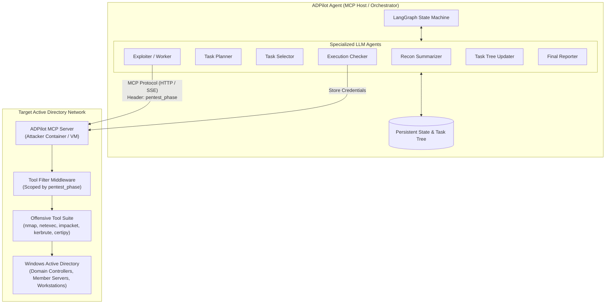
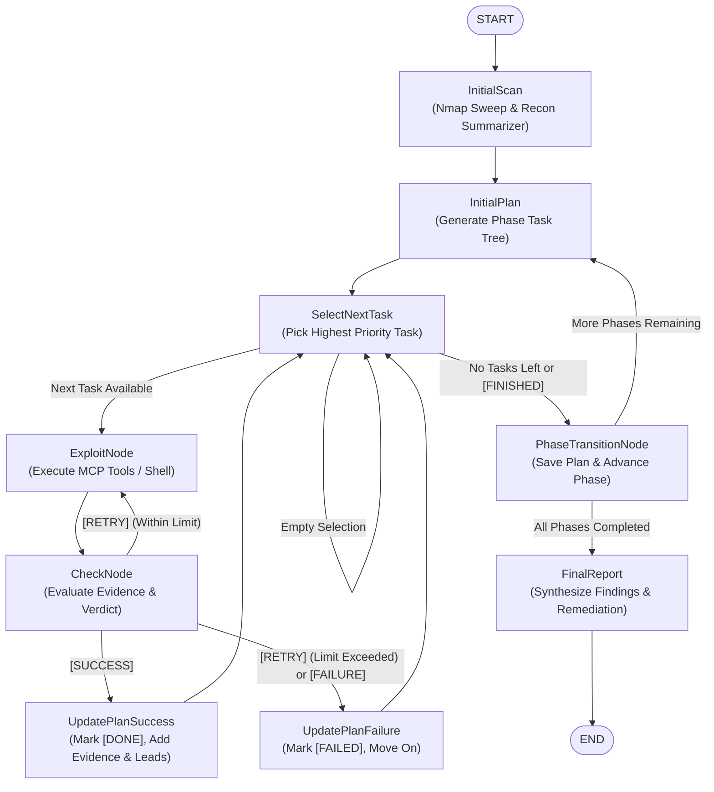

# ADPilot Agent

> **Pentesting Automation Using LLMs for Windows Active Directory Systems**

[](https://www.python.org/downloads/)
[](https://github.com/langchain-ai/langgraph)
[](https://modelcontextprotocol.io/)
[](#disclaimer)

**ADPilot Agent** is an autonomous multi-agent orchestration framework (MCP Host) designed to conduct end-to-end authorized penetration tests against Windows Active Directory (AD) enterprise environments using Large Language Models.

Instead of relying on a single monolithic prompt, ADPilot Agent employs a **hierarchical multi-agent state graph** built with **LangGraph**. It enforces a strict **phased pentesting methodology**, orchestrating specialized agent roles (planning, selecting, exploiting, validating, and reporting) that focus on one operational phase at a time. The agent connects as an **MCP Host** to an **ADPilot MCP Server** deployed on an attacker machine directly inside or adjacent to the target Active Directory network to execute offensive tools and shell commands.

---

## Table of Contents

- [Key Features](#key-features)
- [System Architecture](#system-architecture)
- [Pentest Phases &amp; Methodology](#pentest-phases--methodology)
- [Multi-Agent Roles](#multi-agent-roles)
- [MCP Host &amp; Tool Execution](#mcp-host--tool-execution)
- [Model Modes](#model-modes)
- [Getting Started](#getting-started)
  - [Prerequisites](#prerequisites)
  - [Installation](#installation)
  - [Configuration](#configuration)
- [Running the Agent](#running-the-agent)
- [Interactive Controls &amp; Telemetry](#interactive-controls--telemetry)
- [Project Structure](#project-structure)
- [Testing](#testing)
- [Disclaimer](#disclaimer)

---

## Key Features

- **MCP Host Architecture**: Connects securely over HTTP/SSE to the [`adpilot-mcp-server`](../adpilot-mcp-server) running inside the target network to dynamically discover and invoke offensive security tools (`nmap`, `netexec`, Impacket suite, `kerbrute`, `certipy`, `hashcat`, etc.).
- **Phase-Bounded Operation**: Enforces clear boundaries across four Active Directory pentest phases. Tools and agent goals are scoped strictly to the current phase to prevent out-of-order execution, speculative pivoting, or accidental lockouts.
- **Dynamic Phase Filtering**: Passes the active pentest phase to the MCP Server via session headers (`pentest_phase`), ensuring the LLM is only exposed to tools relevant to the current operational phase.
- **Hierarchical Multi-Agent Graph**: Orchestrates specialized agents for reconnaissance extraction, task planning, task selection, command execution, quality checking, task tree updates, and final reporting.
- **Evidence-Driven Task Tree**: Maintains persistent, tree-structured task plans (`1.1`, `1.2`, etc.) that evolve dynamically based on demonstrated findings rather than speculative assumptions.
- **Skeptical Quality Gate (Checker)**: An independent validation agent verifies execution outputs to prevent false positives before marking tasks as `[DONE]`, `[RETRY]`, or `[FAILED]`.
- **Tool Execution Guardrails**: Enforces hard limits on tool calls per task and consecutive calls of the same tool to prevent infinite loops and runaway token usage.
- **Multi-Model Support (Remote, Local, Hybrid)**: Compatible with Google Gemini (Vertex AI / Google GenAI), OpenAI, Anthropic, OpenRouter, and local Ollama models.
- **Interactive Human-in-the-Loop CLI**: Allows operators to monitor real-time execution logs and fast-forward or advance phases at will.
- **Comprehensive Reporting**: Automatically synthesizes findings into an executive and technical Markdown report complete with attack paths, compromised credentials, demonstrated vulnerabilities, and targeted remediation steps.

---

## System Architecture

The following diagram illustrates how ADPilot Agent connects as an MCP Host to the remote MCP Server running on the attacker machine within the Active Directory network:



### Agent Workflow (LangGraph State Machine)

The state graph coordinates the end-to-end penetration testing lifecycle:



---

## Pentest Phases & Methodology

ADPilot enforces an offensive methodology structured into four distinct, sequential Active Directory testing phases:

| Phase                                   | Phase Identifier                              | Primary Objective                                                   | Allowed Activities                                                                                                                            | Forbidden Activities                                                                |
| :-------------------------------------- | :-------------------------------------------- | :------------------------------------------------------------------ | :-------------------------------------------------------------------------------------------------------------------------------------------- | :---------------------------------------------------------------------------------- |
| **1. External Reconnaissance**    | `external_reconnaissance`                   | Map the external perimeter and discover attack surface.             | Port/service scanning, DNS resolution, anonymous SMB/LDAP enumeration, Kerberos user discovery.                                               | Credential testing, password spraying, authentication, exploitation, hash cracking. |
| **2. Initial Access**             | `initial_access`                            | Establish the first authenticated foothold in the domain.           | AS-REP roasting, Kerberoasting, password spraying, offline hash cracking, credential validation.                                              | Deep internal AD mapping, privilege escalation, lateral movement, persistence.      |
| **3. Internal Reconnaissance**    | `internal_reconnaissance`                   | Map domain objects and relationships from the established foothold. | LDAP queries, domain users/groups/SPNs enumeration, ACL & delegation mapping, RID cycling, BloodHound collection.                             | Active privilege escalation, lateral movement, password modification.               |
| **4. Lateral Movement & PrivEsc** | `lateral_movement_and_privilege_escalation` | Elevate privileges and demonstrate domain compromise.               | Local privilege escalation, token/ticket abuse, AD CS exploitation (Certipy), remote command execution (WMI, WinRM), DCSync, secrets dumping. | None (conducted within authorized scope).                                           |

### Phase Transition Mechanics

- **Autonomous Progression**: When the `SelectNextTask` agent identifies that all tasks in the current phase are marked as `[DONE]` or `[FAILED]` and no new evidence-driven leads exist, it emits `[FINISHED]`.
- **Manual Intervention**: Operators can type `n` or `next` into the terminal at any point to fast-forward past an exhaustive phase.
- **State Archiving**: When transitioning, `PhaseTransitionNode` archives the completed phase's task tree into the global state (`external_recon_plan`, `initial_access_plan`, `internal_recon_plan`, `lateral_privesc_plan`), which becomes historical context for subsequent phases.

---

## Multi-Agent Roles

Each node in the LangGraph workflow utilizes an LLM prompted with a strict persona and operational boundary:

1. **Recon Summarizer (`InitialScan`)**:
   - Executes an initial Nmap sweep via the MCP server's `shell_exec` tool.
   - Operates as a lossless, deterministic extraction engine that parses raw Nmap scan output into structured, host-by-host JSON/markdown metadata without hallucinating CVEs or vulnerabilities.
2. **Task Planner (`InitialPlan`)**:
   - Analyzes reconnaissance findings, target scope, available phase tools, and prior phase task trees.
   - Creates a minimal, hierarchical task tree (e.g. `1.1`, `1.2`) strictly bounded by the rules of the current phase.
3. **Task Selector (`SelectNextTask`)**:
   - Scans the active plan for pending tasks.
   - Selects the next single task to execute, gathers necessary context (domain name, discovered credentials, hashes, targets), and passes it to the worker. Emits `[FINISHED]` when no viable tasks remain.
4. **Execution Worker / Exploiter (`ExploitNode`)**:
   - Executes the assigned task using the phase-filtered MCP tools.
   - Iteratively diagnoses errors, adjusts arguments, and extracts exact technical evidence.
   - Bound by strict tool-call budgets and streak caps.
5. **Execution Quality Checker (`CheckNode`)**:
   - Skeptically evaluates whether the task objective was actually achieved based on factual evidence produced (not merely worker claims).
   - Produces a deterministic verdict: `[SUCCESS]`, `[RETRY]`, or `[FAILURE]`.
   - Stores newly validated credentials into the MCP server's credential store (`credentials_add`).
6. **Task Tree Updater (`UpdatePlanSuccess` / `UpdatePlanFailure`)**:
   - Updates task status (`[DONE]` or `[FAILED]`) and appends findings beneath the task.
   - Generates follow-up tasks **only** if new technical evidence justifies them, allowing the tree to naturally converge.
7. **Final Report Generator (`FinalReport`)**:
   - Collects all historical task trees and queries the MCP server for all recorded credentials.
   - Synthesizes a client-ready markdown report with executive summaries, attack paths, affected systems, demonstrated vulnerabilities, statistics, and actionable remediation guidance.

---

## MCP Host & Tool Execution

ADPilot Agent communicates with the MCP server using `mcp.client.streamable_http` and `langchain_mcp_adapters`.

### Dynamic Tool Header

Every tool session sends an HTTP header specifying the active phase:

```python
AGENT_PHASE_HEADER = "pentest_phase"
# Value sent: "external_reconnaissance", "initial_access", etc.
```

The MCP Server's `ToolFilterMiddleware` uses this header to expose only the tools allowed for that phase, preventing LLM confusion and enforcing phase safety.

### Execution Interceptor & Guardrails

All MCP tool calls pass through an async interceptor (`_build_tool_interceptor` in `util/mcp_session.py`) that enforces:

- **Per-Task Budget (`EXPLOIT_MAX_TOOL_CALLS`)**: Limits total tool calls per task execution (default: `10`). If exceeded, blocks execution and prompts the agent to provide its final response using evidence collected so far.
- **Streak Cap (`EXPLOIT_MAX_SAME_TOOL_CALLS_IN_A_ROW`)**: Blocks repeating the exact same tool more than $N$ times consecutively (default: `5`), breaking repetitive loops.
- **Resilient Error Recovery**: Catches tool execution errors and converts them into structured `TOOL_CALL_ERROR` observations so the LLM can self-correct parameters without crashing the workflow.

---

## Model Modes

ADPilot Agent supports flexible model routing via the `MODEL_MODE` setting:

| Mode                 | Description                                                                                                                                                                                                         | Typical Use Case                                                         |
| :------------------- | :------------------------------------------------------------------------------------------------------------------------------------------------------------------------------------------------------------------ | :----------------------------------------------------------------------- |
| `remote` (Default) | Routes all agents to a remote LLM provider (Google Gemini, OpenAI, Anthropic, OpenRouter) via API key or Google ADC.                                                                                                | High-quality reasoning, production assessments, full cloud environments. |
| `local`            | Routes all agents to a locally hosted model via Ollama (e.g.`qwen2.5`, `llama3`).                                                                                                                               | Air-gapped engagements, privacy-sensitive offline environments.          |
| `hybrid`           | Uses`REMOTE_MODEL` for complex tasks (`InitialPlan`, `ExploitNode`, `UpdatePlan`, `FinalReport`) and `LOCAL_MODEL` for fast extraction and checks (`InitialScan`, `SelectNextTask`, `CheckNode`). | Optimized cost, speed, and API quota conservation.                       |

---

## Getting Started

### Prerequisites

- **Python**: 3.12 or higher.
- **Package Manager**: [uv](https://docs.astral.sh/uv/) (recommended) or `pip`.
- **Target Network Access**: Running instance of [`adpilot-mcp-server`](../adpilot-mcp-server) accessible over HTTP/HTTPS (direct or via ngrok tunnel).

### Installation

Clone the repository and install dependencies using `uv`:

```bash
# Clone the repository
git clone https://github.com/DiogoCorreia03/ADPilot.git
cd ADPilot/adpilot-agent

# Install dependencies in a virtual environment
uv sync
```

### Configuration

Copy the example configuration file:

```bash
cp .env.example .env
```

Edit `.env` to configure your environment:

```ini
DEBUG=False

# MCP Server Settings (Attacker Machine)
ATTACKER_MACHINE_URL="https://your-ngrok-subdomain.ngrok-free.app/mcp"
ATTACKER_MACHINE_AUTH_TOKEN="user:password"

# Target Active Directory Environment
NETWORK="192.168.122.0/24"
DC_IP="192.168.122.10"
IGNORED_HOSTS="192.168.122.1,192.168.122.2,192.168.122.57"

# Model Selection
MODEL_MODE="remote"
REMOTE_MODEL="gemini-2.5-flash"
REMOTE_API_KEY="your-gemini-api-key"
# MODEL_PROVIDER="google-genai" # Optional: inferred if omitted

# For local/hybrid modes:
# LOCAL_MODEL="qwen2.5"

# Execution Controls & Safety Limits
ENABLE_INTERACTIVE_CLI=true
EXPLOIT_MAX_TOOL_CALLS=10
EXPLOIT_MAX_SAME_TOOL_CALLS_IN_A_ROW=5
CHECK_MAX_RETRIES=3

# LangSmith Observability (Optional)
LANGSMITH_TRACING=false
LANGSMITH_ENDPOINT="https://eu.api.smith.langchain.com"
LANGSMITH_API_KEY="your-langsmith-api-key"
LANGSMITH_PROJECT="adpilot-agent"
```

---

## Running the Agent

Launch the agent pipeline using `uv`:

```bash
uv run adpilot-agent
```

Or run via Python module:

```bash
uv run python -m adpilot_agent.main
```

---

## Interactive Controls & Telemetry

### Interactive Phase Advancement

During execution, an interactive background listener monitors `sys.stdin`. If a phase has discovered sufficient leads or you wish to skip ahead:

- Type `n` or `next` and press <kbd>Enter</kbd>.
- The agent will finish its current task and transition immediately to the next pentesting phase.

### Telemetry & Output Artifacts

Execution outputs and logs are organized automatically:

- `reports/`: Markdown reports generated by the `FinalReport` agent upon assessment completion (`<model>-<timestamp>.md`).
- `logs/`: Application logs containing agent state transitions, debug messages, and MCP session statuses (`run-<timestamp>.log`).
- `executions/`: Detailed prompts, LLM responses, and raw tool invocations recorded by the execution logger (`execution-<timestamp>.jsonl`).
- **Run Summary**: Prints aggregate tool calls, tool error counts, and input/output token usage per phase upon completion.

---

## Project Structure

```
adpilot-agent/
├── pyproject.toml               # Project dependencies and script definitions
├── uv.lock                      # Deterministic dependency lockfile
├── .env.example                 # Example environment variables template
├── src/
│   └── adpilot_agent/
│       ├── __init__.py
│       ├── main.py              # Main entrypoint and LangGraph workflow definition
│       ├── prompts/             # Agent system prompts and phase specifications
│       │   ├── specs.py         # Phase definitions, objectives, and allowed/forbidden scopes
│       │   ├── summarizer.py    # Recon summarizer prompt
│       │   ├── planner.py       # Hierarchical task tree planner prompt
│       │   ├── selector.py      # Task selection and context retrieval prompt
│       │   ├── exploiter.py     # Worker execution prompt with tool constraints
│       │   ├── checker.py       # Execution quality gate and verdict rules
│       │   ├── updater.py       # Deterministic task tree mutation prompt
│       │   ├── reporter.py      # Comprehensive penetration testing report prompt
│       │   └── template.py      # Dynamic prompt formatting helpers
│       └── util/
│           ├── config.py        # Pydantic Settings and environment validation
│           ├── exceptions.py    # Custom LLM response exception classes
│           ├── mcp_session.py   # MCP client session, HTTP auth, and tool interceptors
│           ├── metrics.py       # Token usage and tool execution metrics tracking
│           ├── models.py        # Chat model factory (local, remote, hybrid)
│           ├── nodes.py         # LangGraph node execution functions
│           ├── routers.py       # Conditional edge routing logic
│           └── state.py         # TypedDict PentestState and Phase definitions
├── tests/                       # Unit and integration test suite
│   ├── conftest.py
│   ├── test_config.py
│   ├── test_metrics.py
│   ├── test_models.py
│   ├── test_prompts.py
│   ├── test_remediation.py
│   ├── test_routers.py
│   └── test_verdicts.py
├── reports/                     # Generated final assessment reports
├── logs/                        # Application run logs
└── executions/                  # Execution transcripts and tool telemetry
```

---

## Testing

Run the test suite using `pytest`:

```bash
uv run pytest
```

All 30+ tests validate settings parsing, router decisions, verdict extraction, phase transitions, and prompt generation.

---

## Disclaimer

> [!CAUTION]
> **Authorized Security Testing Only**: This tool is designed exclusively for authorized penetration testing, security evaluations in isolated laboratory environments, and academic research. Operating this software against networks or Active Directory systems without prior explicit written authorization is strictly illegal and violates computer crime statutes. The authors and contributors assume no liability for misuse or damage caused by this software.
